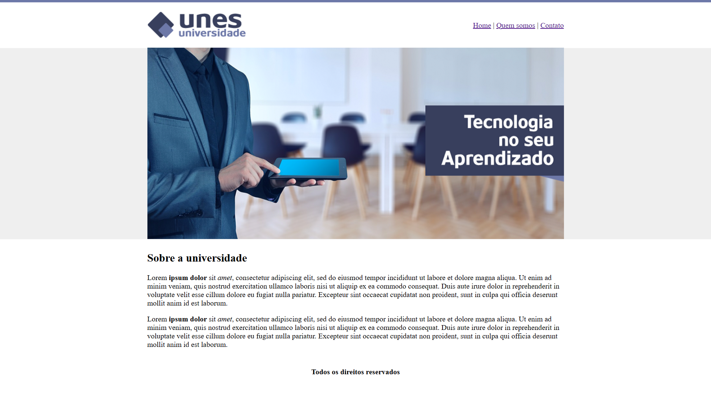
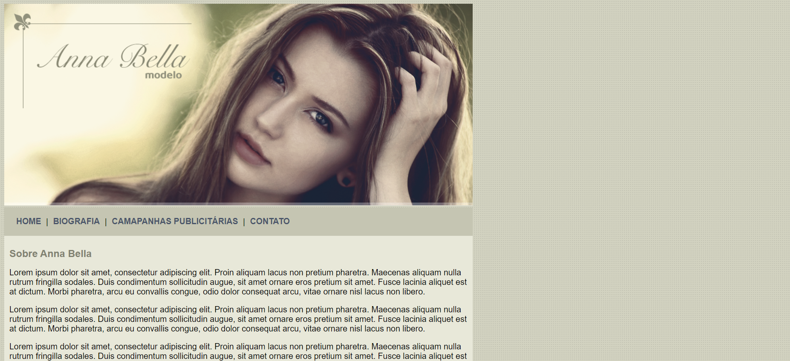
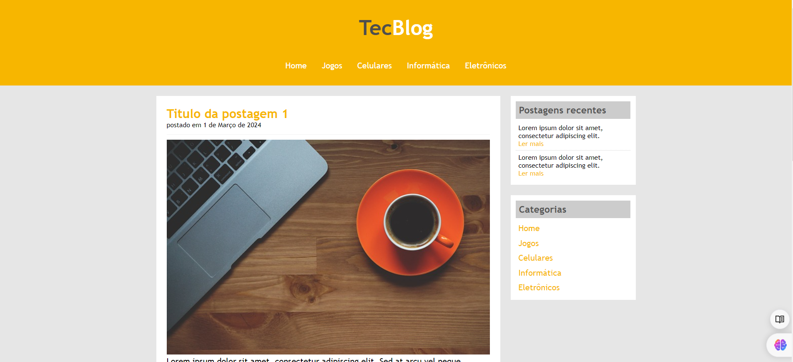

<h1>Curso de Desenvolvimento Web</h1>

Olá! Este repositório destina-se aos projetos desenvolvidos durante o curso de Desenvolvimento Web, ministrado pelos professores Jamilton Damasceno e Jorge Sant Ana.

<h3>Sumário</h3>

A seguir são listados os projeto desenvolvidos no curso

- [Unes universidade](#unes-universidade)
- [Página da modelos Anna Bella](#página-da-modelo-anna-bella)
- [Tec Blog](#tec-blog)

## Unes universidade

    

**Status**: :white_check_mark: Finalizado :white_check_mark:

Neste projeto, desenvolveu-se um site para uma universidade fictícia chamada Unes. Nele, foi aplicado os fundamentos essenciais do HTML, construindo todo o projeto sem a utilização de CSS, apenas com HTML, e incorporando imagens para enriquecer a experiência visual.

### Páginas do projeto

- Início
- Quem somos
- Contato

<h3>Tecnologias utilizadas</h3>

    

        
        <label>Html 5</label>    
    

## Página da modelo Anna Bella

    

**Status**: :white_check_mark: Finalizado :white_check_mark:

Neste projeto, desenvolveu-se uma página para uma modelo fictícia chamada Anna Bella. Nele, foi implementado os conceitos iniciais do CSS, e adicionado imagens da modelo para enriquecer a experiência visual do usuário. O site é composto por páginas HTML estáticas que apresentam informações sobre a biografia de Anna Bella, campanhas publicitárias e formas de contato.

### Páginas do projeto

- Home
- Biografia
- Campanhas publicitárias
- Contato

<h3>Tecnologias utilizadas</h3>

    

        
        <label>Html 5</label>    
    

    

       
        <label>CSS 3</label>    
    

## Tec Blog

    

**Status**: :white_check_mark: Finalizado :white_check_mark:

O Tec Blog, um blog de tecnologia, aborda temas como jogos, celulares, informática e eletrônicos. O site é composto por páginas HTML estáticas estilizadas com CSS para proporcionar uma experiência agradável e intuitiva para os usuários.

### Páginas do projeto

- Home

<h3>Tecnologias utilizadas</h3>

    

        
        <label>Html 5</label>    
    

    

       
        <label>CSS 3</label>    
    

## Notícias Cidade

    

**Status**: :white_check_mark: Finalizado :white_check_mark:

Notícias Cidade é um site de notícias que cobre uma variedade de tópicos como Brasil, Internacional, Economia, Saúde e Ciência. O site é composto por páginas HTML estáticas estilizadas com CSS para proporcionar uma experiência agradável e intuitiva para os usuários.

### Páginas do projeto

- Home
- Brasil
- Fotos

<h3>Tecnologias utilizadas</h3>

    

        
        <label>Html 5</label>    
    

    

       
        <label>CSS 3</label>    
    

